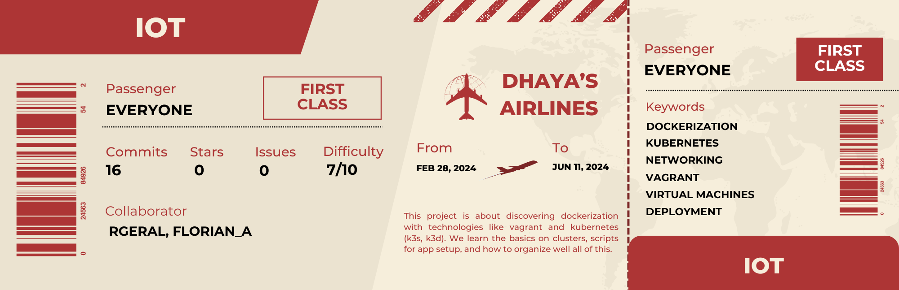

<p aligne="center">
    
</p>

<h1 align="center">
    IoT
</h1>

<p align="center">
	<b><i>Project to learn the basics of kubernetes and application deployment.</i></b><br>
</p>

## Important commands

```
vagrant up
```

to execute a Vagrantfile.

```
vagrant halt
```

to stop a machine.

```
vagrant destroy
```

to delete everything the Vagrantfile did.

```
vagrant ssh <machineName>
```

to connect with ssh to a machine.

```
vagrant status
```

to see a list of the actually running machines.

IMPORTANT, for part 3 no vagrant files are allowed so you need to execute the server.sh with makefile doing "make".
It is meant to work on recents versions of Ubuntu and nothing else since no VM is used here. 

## Quick explainations

The same way we use a Dockerfile with docker, here we use a Vagrantfile with vagrant. This file contains all the informations about the vm itself, size, memory required, CPU, name, shared files, network protocols and params... etc. In this project I use VirtualBox with Vagrant.

### P1

Here we are gonna create 2 vm. One worker, and one server which is the main node of our kubernetes cluster. We use k3s for this first part. The difficult part is to find the precise command with the right params to install k3s as the main node, plus k3s and I guess kubernetes in general uses env variable for configuration which was special to understand at first.

To explain quickly what happens in our script, the Vagrantfile create 2 vm with the same stats, only changing the name and the IP address. It also calls two different scripts for each vm, server.sh for the main node, and worker.sh for the first worker. The server is gonna install k3s in server mode, then share the token to join its cluster in /vagrant_shared folder, which correspond to our /confs folder. Then simply adding aliases and update env variables to fit the subject we have. The worker is then gonna initiate itself, then install k3s in worker mode using the token shared by the master, to join the cluster and be a functionnal worker. Same thing with the aliases and variables and we are done.

### P2

Here we only need one vm, with k3s in server mode installed, the changes are inside the configuration file, so the server.sh script cause we need to add a lot of things to this master node server.
The subjectss also talk about replicas which seems to be a similar word for "pods" in k3s, or at least it is pods replicas that we are talking about.
We need to make 3 web app on this server, to make an app we need yaml files, a Deployment, and a Service. You can place them both in one file or in different files.

- Deployments are made to create and initiate pods, replicas and their configurations.
- Services are made to allow communication between those pods among the cluster. It can also be used to allow external communications but another tool is used for that.
- Ingresses are this tool, they allow a way easier access management, routing, loadbalancer, and allow to have only one entrypoints even with multiple services which would be hard to handle if we had numerous apps. It is for this reason of "architecture logic" that I decided to separate the Ingress in a file apart from the 3 apps.
- ConfigMap, this one is a little dofferent, it is not a seperate file, but more a configuration shared by the deployment and the script to map the right html file for the right app, allowing us to host multiple web app, on a single IP address.

Finally we have to apply each deployment and services files, along with the ingress, to lanch the 3 web-app, and everything is now working.

### P3

This part was a little more time consuming. We first have to install every component that could not be installed in the machine to be sure everything work as expected, here we need docker, kubectl, k3d and argocd. The script is long but I'm gonna try to explain how it works:

- First some checks to see if we have sudo priviledges and if we are in the right folder to execute the code (we use relative paths so it's necessary).
- Install docker, kubectl and the tools that we need in general.
- Install k3d and create a cluster with all ports that we need, 1 server and 3 agents (check part one if you don't get that, agent = worker).
- Install argocd, apply the ingress for networking and check that everything is up and running.
- Install argocd-cli in order to login, inside argocd, check that everything works well.
- Then create the app we want to host, with our github repo, that is linked to a docker image, the wil one in my case.
- Finally printing all the informations for the user in order to test is everything is wokring correctly.

The script is long cause it makes a lot of checks but that is pretty much it, we now have an argocd running, and a dev app launched and that will auto update itself when anything is changed in the manifests folder of the github repo. 

## Important doc

[k3s offical doc](https://docs.k3s.io/quick-start)

[Vagrant file example](https://akos.ma/blog/vagrant-k3s-and-virtualbox/)

[What are Services and Deployments files](https://matthewpalmer.net/kubernetes-app-developer/articles/service-kubernetes-example-tutorial.html#:~:text=A%20deployment%20is%20responsible%20for,and%20pods%20could%20be%20replicated.)

[k3d official doc](https://k3d.io/v5.4.2/#quick-start)

[ArgoCD official doc](https://argo-cd.readthedocs.io/en/stable/getting_started/)

[Setup k3d and ArgoCD](https://yashguptaa.medium.com/application-deploy-to-kubernetes-with-argo-cd-and-k3d-8e29cf4f83ee)

[Install docker on debian](https://docs.docker.com/engine/install/debian/)
